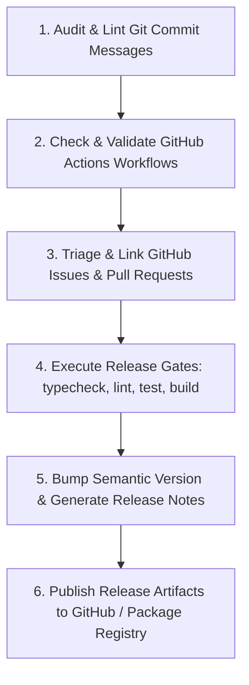

# GitHub Publishing & CI/CD Automation Playbook

This playbook defines the standardized operational workflow for publishing releases, managing GitHub Issues, authoring secure GitHub Actions workflows, and enforcing Conventional Commits across GitHub repositories.

---

## 1. Core Principles & Skill Integrations

1. **Conventional Commits & Semantic Versioning (`git-commit`)**:
   - All commits MUST follow the Conventional Commit specification: `<type>(<scope>): <short summary>`.
   - Types: `feat` (minor version bump), `fix` (patch version bump), `BREAKING CHANGE:` (major version bump), `docs`, `chore`, `refactor`, `perf`, `test`.
   - Commit messages must be imperatively phrased, lowercase summary, no trailing period.

2. **GitHub Actions Workflow Standards (`create-github-action-workflow-specification`)**:
   - Least-privilege GITHUB_TOKEN permissions (`permissions: { contents: read }`).
   - Pinned action versions with SHA or major release tags (`actions/checkout@v4`, `oven-sh/setup-bun@v2`).
   - Built-in dependency caching (`cache: 'bun'` or `cache: 'npm'`).
   - Matrix builds for cross-platform/node/bun verification (macOS, Ubuntu, Windows).

3. **GitHub Issues & Release Triage (`github-issues`)**:
   - Automated issue linking via commit messages (`Fixes #123`, `Closes #456`).
   - Categorized release notes generation (Features, Fixes, Breaking Changes, Maintenance).
   - Label & milestone assignment during release lifecycle.

4. **Zero Unverified Releases**:
   - Never publish to npm, GitHub Packages, or GitHub Releases without passing all automated verification gates (`typecheck`, `test`, `lint`, `build`).

---

## 2. Conventional Commit Specification (`git-commit`)

```bash
# Feature addition (triggers MINOR version bump v1.1.0)
git commit -m "feat(autopilot): add bounded retry scheduler with exponential backoff"

# Bug fix (triggers PATCH version bump v1.0.1)
git commit -m "fix(cli): resolve permission denial on custom playbook activation"

# Breaking change (triggers MAJOR version bump v2.0.0)
git commit -m "feat(api)!: migrate state schema to v2 event chain

BREAKING CHANGE: The state.json schema v1 is deprecated. Migrations are performed automatically."
```

---

## 3. Production GitHub Actions Workflow (`.github/workflows/release.yml`)

```yaml
name: CI/CD Release Pipeline

on:
  push:
    branches: [main]
  pull_request:
    branches: [main]
  release:
    types: [published]

permissions:
  contents: read

jobs:
  verify:
    name: Verify & Test
    runs-on: ubuntu-latest
    steps:
      - name: Checkout Code
        uses: actions/checkout@v4

      - name: Setup Bun Environment
        uses: oven-sh/setup-bun@v2
        with:
          bun-version: latest

      - name: Install Dependencies
        run: bun install --frozen-lockfile

      - name: Run Typecheck
        run: bun run typecheck

      - name: Run Linter
        run: bun run lint

      - name: Run Test Suite
        run: bun test

      - name: Verify Production Build
        run: bun run build

  publish:
    name: Publish Release Artifacts
    needs: verify
    if: github.event_name == 'release'
    runs-on: ubuntu-latest
    permissions:
      contents: write
      id-token: write # Required for npm provenance / OIDC
    steps:
      - name: Checkout Code
        uses: actions/checkout@v4

      - name: Setup Bun Environment
        uses: oven-sh/setup-bun@v2
        with:
          bun-version: latest

      - name: Install Dependencies
        run: bun install --frozen-lockfile

      - name: Build Distribution Bundle
        run: bun run build

      - name: Publish to NPM / GitHub Packages
        env:
          NODE_AUTH_TOKEN: ${{ secrets.NPM_TOKEN }}
        run: npm publish --access public --provenance
```

---

## 4. Execution Workflow (Sequential Pipeline)



---

## 5. Release Checklist

- [ ] All commit messages since last tag conform to Conventional Commits.
- [ ] GitHub Actions workflow `.github/workflows/release.yml` syntax validated.
- [ ] Minimal token permissions (`contents: read` / `contents: write`) enforced.
- [ ] All open issues linked to the release milestone triaged.
- [ ] All verification commands (`bun test`, `bun run typecheck`, `bun run lint`, `bun run build`) passed with zero errors.
- [ ] Package distribution dry-run (`npm publish --dry-run` or `bun pm pack`) verified.
