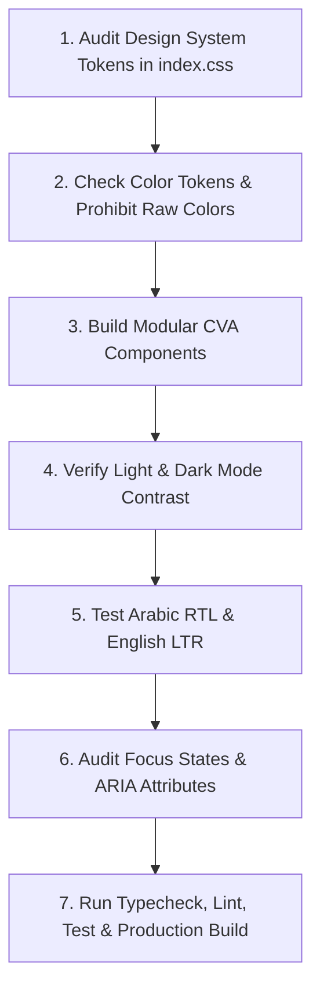

# Vercel-Inspired UI/UX Design Engineering Playbook

This playbook establishes the authoritative UI/UX design engineering rules, visual aesthetics, component composition patterns, typography hierarchy, and accessibility standards for building world-class, premium web interfaces inspired by Vercel Design Systems, Radix UI, and ShadCn UI.

---

## 1. Design Philosophy & Core Principles

1. **Semantic Design Tokens over Ad-Hoc Styling**:
   - Every color, gradient, border, and shadow MUST be driven by CSS variables in `index.css`.
   - **STRICT PROHIBITION**: NEVER use raw direct color classes like `text-white`, `bg-white`, `text-black`, `bg-black`, `bg-blue-500`. ALWAYS use semantic design tokens: `text-foreground`, `bg-background`, `bg-card`, `text-primary`, `border-border`, `bg-accent`.

2. **Intentional White Space & Sub-Pixel Alignment**:
   - Layouts must breathe. Use standard spacing increments (4px, 8px, 16px, 24px, 32px, 48px, 64px).
   - Align text baseline to grid, ensure sub-pixel rendering with `-webkit-font-smoothing: antialiased`.

3. **Subtle Motion & Purposeful Micro-Animations**:
   - Animations should provide immediate tactile feedback, not distract.
   - Use standardized cubic-bezier transitions (`cubic-bezier(0.4, 0, 0.2, 1)`) with durations between 150ms and 300ms.

4. **Flawless Light & Dark Mode Contrast**:
   - Test every component in both light and dark themes.
   - Ensure a minimum contrast ratio of 4.5:1 for standard text and 3:1 for large headings (WCAG 2.2 AA).

---

## 2. Semantic Design System Tokens (`index.css`)

Always define and customize the theme tokens inside `index.css`:

```css
@layer base {
  :root {
    /* Light Mode Palette (HSL) */
    --background: 0 0% 100%;
    --foreground: 222 47% 11%;
    --card: 0 0% 98%;
    --card-foreground: 222 47% 11%;
    --popover: 0 0% 100%;
    --popover-foreground: 222 47% 11%;
    --primary: 250 84% 60%;
    --primary-glow: 250 84% 75%;
    --primary-foreground: 210 40% 98%;
    --secondary: 210 40% 96.1%;
    --secondary-foreground: 222 47% 11.2%;
    --muted: 210 40% 96.1%;
    --muted-foreground: 215.4 16.3% 46.9%;
    --accent: 320 89% 60%;
    --accent-foreground: 222 47% 11.2%;
    --destructive: 0 84.2% 60.2%;
    --destructive-foreground: 210 40% 98%;
    --border: 214.3 31.8% 91.4%;
    --input: 214.3 31.8% 91.4%;
    --ring: 250 84% 60%;
    --radius: 0.75rem;

    /* Gradients & Special Effects */
    --gradient-hero: linear-gradient(135deg, hsl(var(--primary)), hsl(var(--accent)));
    --gradient-subtle: linear-gradient(180deg, hsl(var(--background)), hsl(var(--card)));
    --shadow-elegant: 0 10px 30px -10px hsl(var(--primary) / 0.2);
    --shadow-glow: 0 0 35px hsl(var(--primary) / 0.25);
  }

  .dark {
    /* Dark Mode Palette (Vercel Midnight) */
    --background: 224 71% 4%;
    --foreground: 213 31% 91%;
    --card: 224 71% 7%;
    --card-foreground: 213 31% 91%;
    --popover: 224 71% 7%;
    --popover-foreground: 213 31% 91%;
    --primary: 250 84% 67%;
    --primary-glow: 250 84% 80%;
    --primary-foreground: 222 47% 11%;
    --secondary: 215 27.9% 16.9%;
    --secondary-foreground: 210 40% 98%;
    --muted: 215 27.9% 16.9%;
    --muted-foreground: 217.9 10.6% 64.9%;
    --accent: 320 89% 65%;
    --accent-foreground: 210 40% 98%;
    --destructive: 0 62.8% 30.6%;
    --destructive-foreground: 210 40% 98%;
    --border: 215 27.9% 16.9%;
    --input: 215 27.9% 16.9%;
    --ring: 250 84% 67%;
  }
}
```

---

## 3. Typography & Responsive Scale Rules

- **Font Hierarchy**:
  - `h1`: Fluid sizing with `text-4xl sm:text-5xl lg:text-6xl`, tracking tight (`tracking-tight`), font weight `font-extrabold`.
  - `h2`: `text-2xl sm:text-3xl`, tracking tight, font weight `font-semibold`.
  - `body`: `text-base` or `text-sm`, text color `text-muted-foreground` or `text-foreground`.
- **RTL & LTR Localization**:
  - Respect text alignment and flow when switching `dir="rtl"` and `dir="ltr"`.
  - Use logical utilities (`ms-*`, `me-*`, `start-*`, `end-*`) instead of directional `ml-*`, `mr-*`, `left-*`, `right-*`.

---

## 4. Component Composition & Variant Architecture

Using Class Variance Authority (`cva`) for reusable UI components:

```tsx
import { cva, type VariantProps } from "class-variance-authority";

export const buttonVariants = cva(
  "inline-flex items-center justify-center rounded-lg text-sm font-medium transition-all focus-visible:outline-none focus-visible:ring-2 focus-visible:ring-ring focus-visible:ring-offset-2 disabled:opacity-50 disabled:pointer-events-none active:scale-[0.98]",
  {
    variants: {
      variant: {
        default: "bg-primary text-primary-foreground hover:bg-primary/90 shadow-sm",
        hero: "bg-gradient-to-r from-primary to-accent text-primary-foreground hover:opacity-95 shadow-lg shadow-primary/25",
        outline: "border border-input bg-background hover:bg-accent hover:text-accent-foreground",
        glass: "bg-background/60 backdrop-blur-md border border-border/50 text-foreground hover:bg-background/80 shadow-sm",
        subtle: "bg-secondary text-secondary-foreground hover:bg-secondary/80",
      },
      size: {
        sm: "h-9 px-3 rounded-md text-xs",
        default: "h-10 py-2 px-4",
        lg: "h-12 px-6 rounded-xl text-base",
      },
    },
    defaultVariants: {
      variant: "default",
      size: "default",
    },
  }
);
```

---

## 5. Accessibility (a11y) & Interactive States

1. **Focus States**: Every interactive element MUST have visible, high-contrast focus rings (`focus-visible:ring-2 focus-visible:ring-ring focus-visible:ring-offset-2`).
2. **Keyboard Navigation**: Full keyboard navigation support (`Tab`, `Enter`, `Space`, `Escape`, `Arrow` keys).
3. **Screen Readers**:
   - Provide `aria-label` or `aria-labelledby` on icon buttons and custom controls.
   - Use semantic HTML tags (`<header>`, `<nav>`, `<main>`, `<section>`, `<article>`, `<footer>`).
4. **Reduced Motion**:
   - Wrap intensive CSS animations in `@media (prefers-reduced-motion: reduce)`.

---

## 6. Execution Workflow & Quality Verification



---

## 7. UI/UX Release Checklist

- [ ] All colors defined as HSL CSS variables in `index.css`.
- [ ] Zero raw color classes (`text-white`, `bg-black`, `bg-blue-500`) in component files.
- [ ] Light and dark modes render with high contrast and zero invisible text.
- [ ] Components use logical CSS properties (`ms-*`, `me-*`) for RTL/LTR parity.
- [ ] Hover, active, focus, loading, empty, and error states present on all interactive components.
- [ ] All build and verification gates (`typecheck`, `lint`, `test`, `build`) green.
