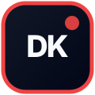

<div align="center">

# Dokion

### *Your rules. Your tools. Proven software.*

A user-directed hardening runtime for Claude Code, Codex, Gemini CLI, and ordinary shell capabilities.

[](docs/superpowers/plans/2026-07-25-m6-release-completion.md)
[](package.json)
[](LICENSE)

</div>

<!-- project-story:start -->
<details open>
  <summary><strong>Problem to project: Why I built Dokion</strong></summary>
  <br />
  <p align="center"></p>
  <table>
    <tr>
      <td width="104" align="center" valign="middle"></td>
      <td valign="middle"><strong>Dokion</strong><br />A user-directed hardening runtime that executes an explicit software repair playbook across coding agents.</td>
    </tr>
  </table>
  <table>
    <tr>
      <td width="50%" valign="top"><strong>Recurring problem</strong><br />Hardening work drifts when agents choose tools, reorder checks, or claim readiness without durable evidence and bounded rollback.</td>
      <td width="50%" valign="top"><strong>Practical goal</strong><br />Let the user own the hardening playbook while Dokion validates execution, journals evidence, verifies repairs, and restores rejected changes.</td>
    </tr>
    <tr>
      <td width="50%" valign="top"><strong>Built for</strong><br />Developers using Claude Code, Codex, Gemini CLI, and shell tools for repeatable software hardening.</td>
      <td width="50%" valign="top"><strong>Search terms</strong><br />software hardening agent · AI repair validation · user directed agent runtime · evidence based code repair</td>
    </tr>
  </table>
  <p><strong>Daily build pulse</strong></p>
  <ul>
      <li>11 commits landed: docs: detail production readiness workstreams (#40); feat: bind resume to repository identity (#39).</li>
      <li>11 pull requests updated, led by #40: docs: detail production readiness workstreams.</li>
      <li>Daily summary covers 22 public activity items from the last 1 day.</li>
  </ul>
</details>
<!-- project-story:end -->

## Current status

Runtime baseline: M0-M6 implemented.

Production hardening backlog: in progress.

Dokion is an executable Bun CLI with cross-agent packaging, adversarial repair validation, clean-install reproduction, package validation, and a protected Bun-only release pipeline. The audited baseline is recorded in [`docs/architecture/current-baseline.md`](docs/architecture/current-baseline.md), and the active production backlog is recorded in [the 100-commit implementation plan](docs/superpowers/plans/2026-07-25-production-grade-bounded-autopilot-backlog.md). This status does not assert general production readiness.

Support claims are separated by host, delivery mode, and agent adapter in the [support and compatibility matrix](docs/compatibility.md). Cross-compilation and packaging are not presented as native host execution.

Implemented:

- M0: schemas, conformance tests, and CI validation
- M1: immutable playbook loading and SHA-256 mutation detection
- M2: ordered execution, state journaling, evidence capture, reporting, and resume
- M3: normalized findings, approval records, declared remediation, and verification
- M4: snapshot-based adversarial repair validation, readiness gates, and exact rollback
- M5: one canonical hardening skill, Claude Code/Codex/Gemini CLI adapters, platform detection, and honest degradation reporting
- M6: embedded runtime assets, exact tarball inspection, clean Bun installation tests, official Gemini validation, cross-platform binaries, and protected release automation

The specification remains the authority for intended behavior. Runtime and release claims are limited to behavior covered by code and CI.

## Authority model

Dokion does not decide which capability should run.

`dokion.json` is an inert catalog. It describes known skills, tools, plugins, loops, and policies. Catalog entries do not execute by being listed.

`.dokion/playbook.json` is the only execution authority. The user owns:

- capability selection
- execution order
- permissions
- approval policies
- retry and stop rules
- verification commands
- release gates

Dokion may validate, execute, journal, verify, explain gaps, and write inert recommendations. It may not autonomously select, install, substitute, reorder, upgrade, or enable a capability.

## Cross-agent model

The hardening workflow is authored once:

```text
skills/dokion-hardening/SKILL.md
```

Platform packages are thin adapters:

```text
Claude Code
  .claude-plugin/plugin.json
  .claude/skills/dokion/SKILL.md
  hooks/hooks.json
  scripts/claude-playbook-guard.ts

Codex
  AGENTS.md
  .codex/AGENTS.md
  .agents/skills/dokion-hardening/SKILL.md

Gemini CLI
  gemini-extension.json
  GEMINI.md
  commands/dokion/run.toml
  commands/dokion/status.toml
```

Adapters translate discovery, packaging, commands, context, and hooks. They do not create a second workflow and do not receive authority to alter the playbook.

## Platform guarantees and degradations

Dokion detects the active agent conservatively. `DOKION_AGENT` is the explicit authority. Unambiguous platform environment markers may be used when the explicit value is absent. Conflicting evidence becomes `other` rather than guessing.

A guarantee is recorded only when explicit evidence is available:

```text
DOKION_GUARANTEE_HOOK_ENFORCEMENT=1
DOKION_GUARANTEE_SUBAGENT_ISOLATION=1
DOKION_GUARANTEE_PARALLEL_WRITES=1
DOKION_GUARANTEE_WORKTREE_ISOLATION=1
```

Missing evidence is stored in `.dokion/state.json` and displayed in `HARDENING.md` as one or more degradations:

- `NO_HOOK_ENFORCEMENT`
- `NO_SUBAGENT_ISOLATION`
- `NO_PARALLEL_WRITES`
- `NO_WORKTREE_ISOLATION`

Dokion never treats differently capable agents as equivalent without evidence.

## Claude Code integrity guard

The Claude Code plugin registers a `PreToolUse` guard for Bash, Edit, Write, and NotebookEdit. During `RUNNING` or `AWAITING_USER`, it compares the current playbook digest with the digest stored in `.dokion/state.json`.

The guard fails closed for a missing playbook, invalid digest, noncanonical path, symlink, or content mutation. Terminal runs do not keep blocking the user's tools.

## Repair validation

Each remediation receives a repository snapshot captured immediately before the declared repair command.

The validator compares that snapshot with the post-repair tree and checks:

- tracked and untracked non-ignored files
- added, modified, and deleted paths
- edits outside the declared write scope
- newly added suppression directives
- deleted tests and added skip directives
- diff-size limits
- whether a required regression test was actually added or modified

A historical unchanged test does not satisfy `require_regression_test`.

When remediation, adversarial validation, or a verification command fails, Dokion restores the exact pre-remediation state for that finding. This preserves unrelated dirty work that existed before the repair and removes files created by the rejected repair.

Ignored untracked trees are not covered by the repair snapshot. This boundary must remain visible until a bounded ignored-file policy is implemented.

## Distribution proof

Dokion validates the exact archive generated by `bun pm pack`, not only the repository source tree.

The package gate checks:

- required runtime, schema, skill, adapter, and documentation files
- forbidden tests, state, diagnostics, lockfiles, generated output, and credential files
- common secret signatures and private local paths
- package, Gemini extension, and release-tag version synchronization
- canonical-skill wrappers and adapter manifest structure

The clean-install smoke test installs the tarball into an empty Bun project and runs the installed CLI through `node_modules/.bin/dokion`. It verifies that embedded schemas and the inert built-in catalog work without access to the Dokion repository root.

`dokion init` creates state and reporting paths only. It does not silently create an active playbook or copy the built-in catalog into the user's project.

## Release model

The tag workflow re-runs every runtime, contract, distribution, clean-install, and Gemini extension gate before publication.

Release artifacts include:

- Linux x64 baseline binary
- Linux ARM64 binary
- macOS ARM64 binary
- macOS x64 binary
- Windows x64 baseline binary
- Bun package tarball
- SHA-256 checksums

Registry publication uses `bun publish` from the protected `npm-release` GitHub Environment. The token is supplied only through `NPM_CONFIG_TOKEN`.

Dokion does not claim npm OIDC trusted publishing because automatic exchange currently requires npm CLI, which conflicts with the repository's Bun-only package-operation rule. See [docs/RELEASING.md](docs/RELEASING.md).

## Runtime layout

```text
HARDENING.md
.dokion/
  playbook.json
  state.json
  events.ndjson
  findings/
  evidence/
  reports/
  runs/
```

`HARDENING.md` is the human-readable report. `.dokion/state.json` is the machine state used for recovery and resume.

## CLI

```text
Observe
  dokion inspect
  dokion doctor
  dokion status
  dokion findings
  dokion report
  dokion tools list
  dokion skills list
  dokion plugins list
  dokion loops list

Configure
  dokion init
  dokion plan
  dokion validate
  dokion validate --catalog-only

Execute
  dokion run
  dokion resume
  dokion verify
  dokion approve <step:id|finding:id> --by <identity> [--notes <text>]
  dokion reject <step:id|finding:id> --by <identity> [--notes <text>]
```

There is no `dokion install` command.

## Installation

Global CLI:

```bash
bun add --global dokion
```

Repository-local CLI:

```bash
bun add --dev dokion
```

## Development setup

Requirements:

- Bun 1.3.14 or newer
- Python 3 with `jsonschema` for schema conformance development checks
- Git
- system `tar` for exact package archive inspection

```bash
bun install --frozen-lockfile
python3 -m pip install jsonschema
bun test
bun run typecheck
bun run validate:contracts
bun run build
bun run validate:distribution
bun run smoke:package
```

## Minimal project flow

Initialize Dokion-owned state:

```bash
dokion init
```

Create `.dokion/playbook.json` yourself or copy and edit a reference playbook. Replace every placeholder digest with an immutable reference.

Validate before execution:

```bash
dokion validate
```

Preview the exact read-only execution plan:

```bash
dokion plan
```

Run the approved playbook:

```bash
dokion run
```

When a step pauses for approval:

```bash
dokion approve finding:DK-APPSEC-001 --by mamdouh --notes "Approved scoped repair"
dokion resume
```

## Evidence rule

A step succeeds only when the declared command exits successfully and its output is stored as evidence.

A finding reaches `VERIFIED` only when:

1. the repair command completed
2. the repair delta passed adversarial validation
3. every declared verification command exited with code 0
4. required regression-test evidence exists

A suppression-based or incomplete repair becomes `REPAIR_REJECTED`. It never counts toward a readiness gate.

## Repository map

```text
src/
  approvals/       append-only approval decisions
  catalog/         embedded inert catalog
  contracts/       embedded JSON Schema validation
  distribution/    package archive and distribution checks
  engine/          ordered runtime and capability execution
  evidence/        command and repair artifacts
  findings/        normalization and persistence
  inspect/         project inspection
  platform/        agent detection, guarantees, and degradations
  playbook/        immutable playbook loading
  report/          HARDENING.md rendering
  runtime/         embedded package metadata
  state/           atomic state and event journal
  validation/      repair snapshots and adversarial checks

schemas/           manifest, playbook, state, finding, and lock schemas
playbooks/         inert examples and reference playbooks
skills/            canonical agent-neutral Dokion workflow
scripts/           validation, smoke-test, guard, and release tools
templates/         report and implementation contracts
tests/             seeded-defect and runtime acceptance tests
```

## Completion language

Dokion never emits an unqualified claim that a repository is production ready.

The valid completion statement is scoped to the user-configured gates, the tested commit, the stored evidence, platform degradations, and the limitations recorded in `HARDENING.md`.

## License

MIT. See [LICENSE](LICENSE).
