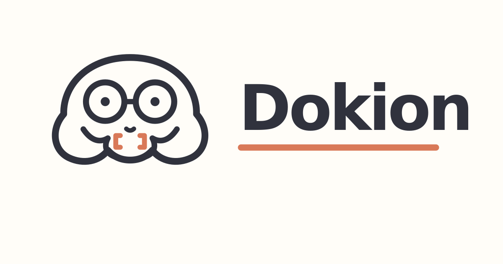

<div align="center">
  

  # ⚡ Dokion Store & Skillaude Workspace

  **Official Marketplace, Provenance Inspection Studio, and AI Skill Builder for Dokion Engine**

  [](https://bun.sh)
  [](https://react.dev)
  [](https://vitejs.dev)
  [](https://tailwindcss.com)
  [](https://dexie.org)
  [](../tasks.md)

</div>

---

## 📌 Overview

**Dokion Store & Skillaude Workspace** is the official web application, marketplace discovery portal, and verified execution studio for Dokion AI Playbooks and Agent Skills. It enables AI engineers, security auditors, and prompt designers to discover, inspect, build, test, buy, sell, and execute cryptographically signed Dokion Playbooks with full provenance verification, content-addressed caching (`sha256:`), and auditable lockfiles (`dokion-lock.json`).

---

## ✨ Key Capabilities

### 🛒 Dokion Playbook Store & Marketplace
- **Verified Playbooks Discovery**: Browse, search, filter, and inspect playbooks by category (Security, Code Review, DevOps, Data Pipelines, AI Testing) or price (Free / Commercial).
- **Independent Registry Source Sync**: Connect to official (`registry.dokion.io`), GitHub community, or custom enterprise registry nodes with live metadata validation.
- **Publisher Portal**: Package, price ($USD or Dokion Tokens), manage licenses, and publish `.dokion` playbook bundles to the store.

### 🛡️ Deep Metadata & Provenance Inspection
- **Cryptographic Signatures**: Pre-retrieval modal validating Ed25519 signatures, publisher identity, and SHA-256 package content digests.
- **Content-Addressed Cache & Inert Installation**: Pulls verified package bytes into IndexedDB cache and writes an auditable `dokion-lock.json` inert lockfile before user activation.
- **Explicit Capability Permission Scopes**: Granular scope review (`TERMINAL_EXEC`, `SUBAGENT_DISPATCH`, `SECRETS_ACCESS`) before capability activation.

### 🛠️ Skillaude Skill Builder & Testing Studio
- **Visual Package Editor**: Full editor for `SKILL.md` instructions, trigger logic, supporting scripts, and example input/output pairs.
- **Dual-Pane Chat Playground**: Interactive chat interface with side-by-side **Compare Mode** (Base Model vs Skill-Enhanced outputs).
- **Quality & Preflight Compliance**: Integrated validator testing formatting, missing sections, and unslop preflight metrics.
- **Local-First Persistence**: High-performance offline-first storage using **Dexie IndexedDB**.

---

## 🎨 Taste-Skill Design Architecture

Built according to high-end agency visual standards (`taste-skill`):

- **Double-Bezel (Doppelrand) Enclosures**: Hardware-inspired nested containers (`.double-bezel` + `.double-bezel-inner`) providing visual depth and machined precision.
- **Button-in-Button CTAs**: Primary action buttons featuring nested trailing icon wrappers (`.btn-pill-nested`) with spring physics (`cubic-bezier(0.32,0.72,0,1)`).
- **Typography Scale**: `Geist` and `Plus Jakarta Sans` for display headlines, `Manrope` for body readability, and `Geist Mono` for code & SHA-256 hashes.
- **Ambient Depth & Glass Panels**: Subtle terracotta (`#D97958`) radial mesh glows (`.mesh-glow`) and backdrop blur glass surfaces (`.glass-panel`).
- **Dokion Mascot System**: Full 6-character mascot set (`Core`, `Reviewer`, `Terminal`, `Guardian`, `Debugger`, `Focus`) mapped to workflow contexts.

---

## 🚀 Getting Started

### Prerequisites
- **Bun** (v1.1+ mandatory for dependency management and script execution)
- **Node.js** (v20+ compatible runtime)

### 1. Install Dependencies
```bash
bun install
```

### 2. Environment Configuration
Copy `.env.example` to `.env.local` and set your Gemini API key:
```bash
cp .env.example .env.local
```
```env
VITE_GEMINI_API_KEY=your_gemini_api_key_here
```

### 3. Run Development Server
```bash
bun run dev
```
Open [http://localhost:3000](http://localhost:3000) in your browser.

### 4. Build for Production
```bash
bun run build
```

### 5. Run Quality & Preflight Audit
```bash
bunx unslop-preflight audit
```

---

## 📁 Repository Structure

```
frontend/
├── dokion-mascot-full-set/   # Official Dokion Mascot SVG & PNG brand assets
├── src/
│   ├── components/           # Double-bezel UI components & modals
│   │   ├── GlobalSearch.tsx            # Global Cmd+K search overlay
│   │   ├── Layout.tsx                  # Top navigation & left rail shell
│   │   ├── PlaybookInspectionModal.tsx # Pre-retrieval inspection modal
│   │   ├── DokionMascot.tsx            # SVG mascot character renderer
│   │   └── CheckoutModal.tsx           # Wallet & license checkout modal
│   ├── context/              # React Auth & Role state contexts
│   ├── db.ts                 # Dexie IndexedDB schemas & tables
│   ├── services/             # Marketplace, CLI API, and Validator services
│   ├── types/                # TypeScript interface definitions
│   ├── views/                # Primary application screens
│   │   ├── MarketplaceStorefront.tsx   # Verified store catalog
│   │   ├── Store.tsx                   # Interactive playbooks store
│   │   ├── Chat.tsx                    # Dual-pane testing playground
│   │   ├── Editor.tsx                  # SKILL.md package editor
│   │   ├── CreatorPublishingWizard.tsx # Publisher wizard
│   │   ├── InstalledCache.tsx          # Installed cache & lockfile viewer
│   │   └── Validation.tsx              # Quality compliance auditor
│   ├── index.css             # Tailwind v4 theme tokens & taste-skill utilities
│   └── main.tsx              # Application entry point
├── index.html                # HTML entry point with Google Fonts
├── package.json              # Package manifest & scripts
├── vite.config.ts            # Vite 6 bundler configuration
└── README.md                 # Project documentation
```

---

## 📜 License

Distributed under the MIT License. See [`LICENSE`](../LICENSE) for details.
